# D-FINE-N and D-FINE-S — synthetic-data detector

> Two sizes of an NMS-free detection transformer, trained only on synthetic pit and crusher renders to find equipment,
> people and boulders, with a domain-randomisation ablation and corruption curves. · Part of: [Models](README.md) ·
> Related: [M10 Synthetic-data detector](../methods/m10-synthetic-data-detector.md) ·
> [Case B2](../cases/b2-synthetic-perception.md) · [Sim-to-real](../theory/sim-to-real.md) ·
> [Export, parity and acceleration](export-parity-acceleration.md)

## What and why

Case B2 asks how far a detector trained **only** on synthetic images can go. D-FINE is the detector family PitStudio
uses for that question because it is Apache-2.0 for code and checkpoints, small enough to run in a browser, and
NMS-free, so its whole post-processing fits inside one ONNX graph [1][2]. Two sizes are trained: **D-FINE-N** (about
4 M parameters, COCO AP 42.8) as the live web detector and **D-FINE-S** (about 10 M parameters, COCO AP 48.5) as the
stronger studio model [1]. Both are fine-tuned from upstream COCO checkpoints on our renders.

## Model card

### Intended use

- Detect haul trucks, shovels, light vehicles, people and boulders in synthetic pit-road and crusher-camera images
  (Isaac Sim + Replicator and ovrtx renders of our own procedural scenes).
- Measure, with confidence intervals, held-out synthetic accuracy, structured vs unstructured domain randomisation (DR)
  and robustness to dust, night and rain; feed the detector + geometric-rule baseline of the
  [Cosmos Reason 2](cosmos-reason-2.md) tasks and B2's "camera streams per GPU" TensorRT panel.

### Out of scope

- Real cameras: sim-to-real for equipment and people is **"not measured"** unless the optional real probe (≤ 200
  licence-clean images, labelled by the maintainer and a second labeller) exists. No safety monitoring or alarms.

### Architecture

D-FINE is a DETR-style detector: a CNN backbone (HGNetv2), a hybrid encoder and a transformer decoder whose queries
attend to multi-scale features through deformable attention, implemented with `grid_sample` [1][2]. Training follows
the DETR set-prediction loss: predictions are matched one-to-one to ground truth by the Hungarian algorithm, so no NMS
is needed [3]:

$$
\hat\sigma=\arg\min_{\sigma\in\mathfrak S_Q}\sum_{i=1}^{Q}\mathcal L_{\text{match}}\big(y_i,\hat y_{\sigma(i)}\big),\qquad
\mathcal L_{\text{box}}=\lambda_{\text{iou}}\big(1-\mathrm{GIoU}(b_i,\hat b_{\hat\sigma(i)})\big)+\lambda_{L1}\lVert b_i-\hat b_{\hat\sigma(i)}\rVert_1,
\qquad
\mathrm{GIoU}(A,B)=\frac{|A\cap B|}{|A\cup B|}-\frac{|C\setminus(A\cup B)|}{|C|}
$$

$Q$ is the number of object queries (–), $y_i$ a ground-truth object padded with "no object", $\mathcal L_{\text{match}}$
the negative class probability plus $\mathcal L_{\text{box}}$, $b$ a box in normalised image coordinates (–), $C$ the
smallest box enclosing $A$ and $B$ (px²), and $\lambda$ loss weights (–) [3][4].

D-FINE's contribution is **Fine-grained Distribution Refinement (FDR)**: each decoder layer $l$ predicts, for every
box edge, a probability distribution $\Pr^l(n)$ over $N$ bins instead of a single offset, and refines it layer by
layer [2]:

$$
\mathbf d^{\,l}=\mathbf d^{\,0}+\{H,H,W,W\}\cdot\sum_{n=0}^{N}W(n)\,\Pr^{l}(n),\qquad l=1\dots L
$$

$\mathbf d^0=\{t,b,l,r\}$ are the initial distances from the box centre to its edges and $H, W$ the initial box height
and width (normalised units). $W(n)$ is a non-uniform weighting function, steep near the bin ends and fine near zero,
shaped by hyperparameters $a$ (upper bound) and $c$ (curvature); the paper's default is $N = 32$ [2]. **GO-LSD**
(Global Optimal Localization Self-Distillation) distils the final layer's refined distributions into shallower layers
with a KL-based "decoupled distillation focal" loss plus a "fine-grained localization" loss [2]. The exporter keeps
the top-K selection inside the graph [5].

### Training data

| Arm | Images | Content | Licence |
|---|---|---|---|
| Structured DR, families 1 and 2 | ~10k per family | Replicator + ovrtx renders of our procedural pit; sun from latitude and time, dust optical depth from the plume field, wet roads from the watering schedule [6][7] | ours, CC-BY-4.0 |
| Unstructured DR (ablation) | ~10k | same scenes, uniform texture/light/colour randomisation [8] | ours, CC-BY-4.0 |

People are MakeHuman CC0 exports, textures CC0; no NVIDIA asset is rendered. Splits are grouped by scenario seed and
layout; families and classes are fixed in the perception spec. Card: [synthetic data](../data-contract/dataset-cards/synthetic-data.md).

### Budget (estimate)

**12–25 GPU-h, 8–11 GB VRAM** for all arms. Upstream trains on 4 GPUs [1]; scaling D-FINE-S's 25 GFLOPs per 640²
forward pass gives roughly 2.5–5 h per 10k images × 50 epochs at batch 8–16 (bf16 autocast, no FP8 training). The
runner probe `studio bench` measures it first; the GPU probes are written but not yet run on the reference machine.

### Export and web lane

- **Opset 19**, the top of PitStudio's 17–19 range: ONNX `GridSample` exists only at versions 16, 20 and 22 [9], so
  opset 19 still emits `GridSample-16`, which the ONNX Runtime 1.30 WebGPU EP registers (16–19 only) [10]; opset 19
  also allows FP8 Q/DQ in the TensorRT lane [11]. The upstream exporter (opset 16) is the parity reference [5].
- `torch.onnx.export(dynamo=True, verify=True)` from torch 2.14.1 [12], onnxslim 0.1.97, **IR version pinned to 10**
  (onnx 1.23.1 writes IR 14 by default; ONNX Runtime 1.30 reads at most IR 13).
- Parity gate: ONNX Runtime CPU fp32 vs PyTorch fp32 on ≥ 200 golden images, rtol 1e-3 / atol 1e-5 / max abs 1e-4;
  fp16 and int8 accepted only if mAP50 moves by ≤ 1 pp. Live gate: ≤ 300 ms per image on WebGPU (estimate).

| Variant | Size at 4/2/1 bytes per parameter (estimate) | Lane |
|---|---|---|
| D-FINE-N fp16 | 8 MB (of 16 / 8 / 4 MB) | **LIVE** (ORT-web WebGPU, WASM fallback) |
| D-FINE-S int8 (static QDQ) | 10 MB (of 40 / 20 / 10 MB) | **LIVE** (int8 QDQ on WASM [13]) |
| D-FINE-S fp32 | 40 MB | PRECOMPUTE only (> 25 MB live cap) |

*Export path shared by all models: PyTorch → ONNX (pinned opset and IR) → parity gate → web lanes and TensorRT engines.*

**TensorRT relevance — high, and risky.** Upstream publishes **T4** latencies (TensorRT 10.4, FP16, batch 1):
N 2.12 ms, S 3.49 ms [1] — a T4, not our machine. Tiling a 3840×2160 crusher frame into ~28 overlapping 640² tiles
would cost ~60–100 ms per frame at those speeds (estimate), hence B2's camera-streams-per-GPU metric. But TensorRT
issue **#4813** reports silently wrong **FP32** outputs for **D-FINE-S** on TensorRT 11.1 (scores off by up to 0.15,
boxes by up to 597 px, recall 0.49 → 0.34), also reported on sm_89 and on TensorRT 10.14 / 10.16 [14]. No TensorRT
version is assumed safe: every engine on every TensorRT version and execution provider passes the per-engine parity
gate; a failing engine is **reported as rejected** ([DEC-0010](../architecture/decisions/DEC-0010-tensorrt-per-engine-parity.md)).
Further risks: FP16 grouped convolutions failing to build on TensorRT 11.2 on Ada (#4838) [15], and no INT8/FP8
`GridSample` kernel, so deformable sampling stays FP16 inside INT8 engines [16].

### Pre-registered acceptance criteria

- Synthetic held-out **mAP50 ≥ 0.80 (S), ≥ 0.70 (N)**.
- **Relative drop ≤ 10 pp at corruption severity ≤ 2**, with
  $\Delta_{\text{rel}}(s)=100\,(\mathrm{mAP50}_{\text{clean}}-\mathrm{mAP50}_s)/\mathrm{mAP50}_{\text{clean}}$ in percent.
- **"Structured DR better"** only by the decision rule: the paired 95 % confidence interval of the mAP50 difference
  (structured − unstructured) must exclude 0; otherwise the UI says "no significant difference"
  ([DEC-0016](../architecture/decisions/DEC-0016-pre-registered-decision-rule.md)).
- Sim-to-real for equipment and people: "not measured" unless the optional real probe is labelled.

### Evaluation protocol

- One synthetic held-out test set, disjoint by scenario seed and layout, shared by every arm, so the DR comparison is
  paired on identical images (pairing unit and interval method fixed in the perception spec); per class and overall.
- Corruption curves: dust, night and rain at severities 1–5 following the common-corruptions protocol [17], per
  precision (fp32, fp16, int8), because INT8 robustness under degraded inputs is not guaranteed [18].

### Licence of weights

Upstream code and checkpoints are Apache-2.0 [1]. Training inputs are our CC-BY-4.0 renders built from CC0 assets, so
the fine-tuned weights are **Apache-2.0 + attribution**; the card lists every input. Cosmos captions are display-only
and never curate this training set; if they ever did, NVIDIA Open Model License §3.2 would require "Built on NVIDIA
Cosmos" on this card and in the web app [19].

## Assumptions and limits

- "Structured DR better" is a statement about the synthetic test distribution, which the structured arm resembles; it
  says nothing about real cameras. Published DR evidence comes from cars and construction sites, not mines [7][8].
- Budgets, SDG throughput and browser latency are estimates until measured. Simulation-grade twin, not a live digital
  twin; not a safety system.

## In PitStudio

- **Cases:** [B2](../cases/b2-synthetic-perception.md) (detector, DR ablation, corruption curves, camera streams per
  GPU); [B1](../cases/b1-traffic-proximity.md) (detector + geometric rule for hazard questions).
- **Method:** [M10](../methods/m10-synthetic-data-detector.md); frameworks [PyTorch](../frameworks/pytorch.md),
  [ONNX Runtime](../frameworks/onnx-runtime.md), [TensorRT](../frameworks/tensorrt.md).
- **Env and stages:** SDG in `studio/isaac/` and `studio/rtx/` (`st55_sdg`, `st53_sensors`) → `pipeline/`
  `s10_preprocess` → `s30_train` → `s40_infer` → `s50_evaluate` → `s60_export` → `pipeline/accel/` `s62_accel` →
  `s64_bench`; recipes in [training recipes](training-recipes.md). Artefacts: `models/onnx/` (N fp16, S int8),
  `models/cards/`; TensorRT engines stay local.

## Results

**Not yet trained** — produced in the data-and-models phase. Will be reported: mAP50 (and mAP50:95) per class for N and
S on the synthetic held-out set; structured vs unstructured DR difference with its paired 95 % CI; corruption curves
(dust, night, rain; severities 1–5) per precision; ONNX and fp16/int8 parity; TensorRT per-engine parity including
rejected engines, latency, throughput and J/inference; real-probe metrics only if the probe exists.

## References

1. D-FINE authors. *D-FINE* repository (Apache-2.0; model zoo, COCO AP, T4 TensorRT 10.4 FP16 latencies, training setup). https://github.com/Peterande/D-FINE
2. Peng, Y. et al. (2024). *D-FINE: Redefine Regression Task in DETRs as Fine-grained Distribution Refinement*. ICLR 2025. https://arxiv.org/abs/2410.13842
3. Carion, N. et al. (2020). *End-to-End Object Detection with Transformers*. https://arxiv.org/abs/2005.12872
4. Rezatofighi, H. et al. (2019). *Generalized Intersection over Union*. CVPR 2019. https://arxiv.org/abs/1902.09630
5. D-FINE ONNX exporter (opset 16, post-processor in graph). https://raw.githubusercontent.com/Peterande/D-FINE/master/tools/deployment/export_onnx.py
6. Prakash, A. et al. (2019). *Structured Domain Randomization*. ICRA 2019. https://arxiv.org/abs/1810.10093
7. Neuhausen, M., Herbers, P., König, M. (2020). Synthetic images added to a small real construction-worker set (about +7.5 pp mAP). Applied Sciences 10(14):4948. https://doi.org/10.3390/app10144948
8. Tobin, J. et al. (2017). *Domain Randomization for Transferring Deep Neural Networks from Simulation to the Real World*. IROS 2017. https://arxiv.org/abs/1703.06907
9. ONNX operator `GridSample` (versions 16, 20, 22). https://onnx.ai/onnx/operators/onnx__GridSample.html
10. ONNX Runtime v1.30.0 WebGPU kernel registry. https://raw.githubusercontent.com/microsoft/onnxruntime/v1.30.0/onnxruntime/core/providers/webgpu/webgpu_execution_provider.cc
11. NVIDIA Model Optimizer, Windows examples (FP8 Q/DQ needs opset ≥ 19). https://raw.githubusercontent.com/NVIDIA/Model-Optimizer/main/examples/windows/README.md
12. PyTorch 2.14 `torch.onnx.export` (dynamo default, `verify` default False). https://docs.pytorch.org/docs/2.14/onnx_export.html
13. ONNX Runtime quantization guide (static QDQ for CNNs, S8S8). https://onnxruntime.ai/docs/performance/model-optimizations/quantization.html
14. NVIDIA TensorRT issue #4813 (wrong FP32 outputs for D-FINE-S). https://github.com/NVIDIA/TensorRT/issues/4813
15. NVIDIA TensorRT issue #4838 (FP16 grouped-conv build failure, Ada). https://github.com/NVIDIA/TensorRT/issues/4838
16. onnx-tensorrt operator support (TensorRT 11.3; `GridSample` FP32/FP16/BF16). https://raw.githubusercontent.com/onnx/onnx-tensorrt/main/docs/operators.md
17. Hendrycks, D., Dietterich, T. (2019). *Benchmarking Neural Network Robustness to Common Corruptions and Perturbations*. ICLR 2019. https://arxiv.org/abs/1903.12261
18. Karimov et al. (2025). *Quantization Robustness to Input Degradations for Object Detection*. https://doi.org/10.48550/arXiv.2508.19600
19. NVIDIA Open Model License (Oct 24, 2025), §3.2. https://www.nvidia.com/en-us/agreements/enterprise-software/nvidia-open-model-license/
