# RTX sensor physics: lidar, camera and radar in a dusty pit

> The physics behind PitStudio's simulated sensors: the lidar range equation and beam footprint, Beer–Lambert
> extinction in dust and rain, the camera model with exposure and haze, 77 GHz FMCW radar range and Doppler, and the
> line-of-sight geometry and phase wrapping of ground-based interferometric slope radar. · Part of: [Theory](README.md)
> · Related: [M23 RTX sensor simulation](../methods/m23-rtx-sensor-simulation.md) · [ovrtx](../frameworks/ovrtx.md) ·
> [B1 traffic & proximity](../cases/b1-traffic-proximity.md) · [dust](dust.md) ·
> [slopes and monitoring](slopes-and-monitoring.md)

## What and why

An open pit is a hard place for sensors. Haul roads raise dust, rain and night degrade vision, and the objects that
matter (a person in a vest, a light vehicle beside a 300-t truck, a boulder at the crusher) are small against large
machines. PitStudio simulates five mining sensors and asks what each one still sees when conditions get bad.

The renderers cover part of the physics. ovrtx and Isaac Sim provide RTX lidar (geometry, materials, multi-echo,
range noise), RTX radar (radar cross-section and Doppler) and path-traced cameras [1][2][3][4][5]. Two things are
missing, and PitStudio models them itself:

- **Dust.** The lidar model ships "a Mie scattering based atmospheric simulation model, which currently supports rain",
  with fog, haze and snow planned [1]. Neither ovrtx nor Isaac Sim models dust. PitStudio adds a Beer–Lambert
  post-model.
- **Slope-monitoring radar.** The RTX radar is a detection-and-Doppler model with no phase or interferometric output
  [2][4]. Pit slope radars measure line-of-sight displacement interferometrically [11][12]. PitStudio uses an analytical
  ground-based InSAR model.

| ID | Mining sensor | Simulated by | PitStudio add-on | Case |
|---|---|---|---|---|
| S1 | Truck-mounted lidar for collision avoidance | ovrtx lidar [3]; rain arm in Isaac Sim [1] | Beer–Lambert dust post-model | [B1](../cases/b1-traffic-proximity.md), [B2](../cases/b2-synthetic-perception.md) |
| S2 | Drone survey camera | ovrtx path-traced camera + ground-truth depth [5] | Exposure, noise and vignetting on linear HDR output | [E2](../cases/e2-survey-reconciliation.md) |
| S3 | Fixed crusher camera | ovrtx camera + semantic segmentation [5] | Haze from the dust field | [B2](../cases/b2-synthetic-perception.md), [D1](../cases/d1-blast-muck-pile.md) |
| S4a | 77 GHz proximity radar | ovrtx radar: RCS + Doppler [2][4] | – | [B1](../cases/b1-traffic-proximity.md) |
| S4b | Ground-based slope radar | – (no phase output) | Analytical line-of-sight + phase model | [C1](../cases/c1-slope-time-of-failure.md) |

Many classical relations on this page (the lidar and radar range equations, FMCW range and Doppler, the pinhole camera,
the exposure and noise model, the interferometric phase) are standard textbook forms whose primary texts are **not
yet among the project's verified sources**. Each is tagged "citation UNVERIFIED — pinned at specification" and gets a
primary source and a worked example in the specification phase.

## Lidar

### Range and the range equation

A pulsed time-of-flight lidar measures the round-trip time $\tau$ (s) of a laser pulse, so the range is
$R = c\,\tau/2$ with $c$ the speed of light (m/s). For an extended Lambertian target that fills the beam, the received
power is (citation UNVERIFIED — pinned at specification):

$$
P_r(R) = P_t\, \frac{\rho \cos\theta}{\pi}\, \frac{A_r}{R^2}\, \eta_{\mathrm{sys}}\; T^2(R)
$$

| Symbol | Meaning | Unit |
|---|---|---|
| $P_t$, $P_r$ | transmitted peak power, received power | W |
| $\rho$ | target reflectance (diffuse) | – |
| $\theta$ | incidence angle between beam and surface normal | rad |
| $A_r$ | receiver aperture area | m² |
| $\eta_{\mathrm{sys}}$ | optical and detector efficiency | – |
| $T(R)$ | one-way atmospheric transmittance over the path | – |

Three consequences shape every lidar result:

- Received power falls as $1/R^2$ for extended targets. A target **smaller than the footprint** (a person far away)
  intercepts only part of the beam, which adds roughly another $1/R^2$.
- Reflectance matters linearly: a retroreflective vest returns far more than dark rock.
- The atmosphere enters **twice**, out and back, as $T^2$.

The Omniverse lidar model builds its intensity from exactly these ingredients (reflectance, peak power, wavelength,
pulse duration, quantum efficiency and aperture) and adds a "distance-dependent Gaussian range uncertainty"
(`rangeAccuracyM`) [1]. Return strength is set per material by non-visual material labels such as `stone`, `gravel`,
`dirt`, `mud`, `steel`, `rubber` and the `retroreflective` attribute, independently of the visual shading [16].

A return is **detected** when the received power exceeds the detector threshold, $P_r(R) \ge P_{\min}$.

### Beam divergence and footprint

A beam of exit diameter $D_0$ (m) and full divergence angle $\theta_d$ (rad) has, at range $R$, the footprint diameter

$$
D(R) = D_0 + 2R\tan(\theta_d/2) \approx D_0 + R\,\theta_d
$$

The lidar model exposes the divergence per axis (`divergenceHorDeg`, `divergenceVerDeg`), scan type (ROTARY or
SOLID_STATE) and `maxReturns` per channel (multi-echo) [1]. With angular steps $\Delta\alpha_h$, $\Delta\alpha_v$
(rad), a target of width $w$ and height $\ell$ (m) at range $R$ receives roughly

$$
N_{\mathrm{pts}} \approx \frac{w}{R\,\Delta\alpha_h} \cdot \frac{\ell}{R\,\Delta\alpha_v}
$$

points: the count falls as $1/R^2$. **Worked example (illustrative inputs).** A 0.5 m × 1.7 m person at 50 m, scanned at
0.2° × 0.2° steps (3.49 mrad), receives about $(0.5/0.175)(1.7/0.175) \approx 2.9 \times 9.7 \approx 28$ points; at
100 m, about 7. This is the "points on target" metric of S1.

## Beer–Lambert extinction in dust and rain

### Transmittance

Light travelling through an absorbing and scattering medium with extinction coefficient $\beta(r)$ (1/m) keeps the
fraction

$$
T(R) = \exp\!\Big(-\int_0^R \beta(r)\, dr\Big) = e^{-\tau(R)}
$$

where $\tau$ is the optical depth (–). For a uniform medium $T = e^{-\beta R}$. This is the attenuation term of the
atmospheric scattering model of Narasimhan & Nayar [10]. A lidar return crosses the medium twice, so its power scales
with $T^2 = e^{-2\tau}$.

### How far the lidar still sees

Combine the range equation with the detection threshold. In clear air a target is detected out to $R_0$, where
$K\rho/R_0^2 = P_{\min}$ (all constant factors in $K$). In a uniform dust cloud the limit $R$ satisfies

$$
\frac{K \rho\, e^{-2\beta R}}{R^2} = \frac{K\rho}{R_0^2}
\;\;\Longrightarrow\;\;
R\, e^{\beta R} = R_0
\;\;\Longrightarrow\;\;
R = \frac{W(\beta R_0)}{\beta}
$$

where $W$ is the Lambert W function ($W(z)\,e^{W(z)} = z$). For $\beta \to 0$, $R \to R_0$.

**Worked example (illustrative $R_0 = 100$ m).**

| $\beta$ (1/m) | $\beta R_0$ (–) | $W(\beta R_0)$ (–) | Max range $R$ (m) | One-way $T$ at $R$ (–) |
|---|---|---|---|---|
| 0 | 0 | 0 | 100 | 1.00 |
| 0.005 | 0.5 | 0.352 | 70.3 | 0.70 |
| 0.01 | 1 | 0.567 | 56.7 | 0.57 |
| 0.02 | 2 | 0.853 | 42.6 | 0.43 |
| 0.05 | 5 | 1.327 | 26.5 | 0.27 |

A moderate dust load halves the range, and the loss is worse than the transmittance alone suggests because it enters
twice and compounds with $1/R^2$.

*Beer–Lambert extinction in dust: two-way transmittance, drop-out of distant returns and early returns from the cloud.*

### Calibration to a mining dust study

The dust post-model has three behaviours, all driven by the transmittance along each beam:

1. **Attenuation** of the return intensity by $T^2$.
2. **Drop-out** of returns that fall below the detection threshold.
3. **Early "dust returns"**: backscatter from the cloud itself registers as a point between the sensor and the target.

The thresholds are anchored to Phillips, Guenther & McAree (2017) [8], who report that dust "starts to affect
measurements when the atmospheric transmittance is less than 71 %–74 %", and that the lidar still ranges
**retroreflective** targets at transmittance "as low as 2 %". In optical depth, $-\ln T$:

| Reported transmittance (–) | Optical depth $\tau$ (–) | Meaning in the post-model |
|---|---|---|
| 0.74 to 0.71 | 0.30 to 0.34 | onset of measurable effects |
| 0.02 | 3.9 | retroreflective targets still ranged |

How the reported transmittance maps onto a beam path (one-way over which length) is fixed from the paper's
measurement set-up in the specification (UNVERIFIED — pinned at specification). The S1 metrics and the web dust slider
are expressed in transmittance (the metrics span 0.02–1.0), so this calibration does not depend on any concentration
constant.

### From dust concentration to extinction

The dust field of case C3 gives a mass concentration $C_m$ (g/m³) along each beam. For particles much larger than the
wavelength, extinction is proportional to the projected particle area per unit volume. For spheres of density
$\rho_p$ (g/m³) and effective radius $r_{\mathrm{eff}}$ (m) (citation UNVERIFIED — pinned at specification):

$$
\beta = Q_{\mathrm{ext}}\, \frac{3\, C_m}{4\, \rho_p\, r_{\mathrm{eff}}} = k_{\mathrm{ext}}\, C_m
$$

with extinction efficiency $Q_{\mathrm{ext}}$ (–) and mass extinction coefficient $k_{\mathrm{ext}}$ (m²/g). Two
consequences: fine dust extinguishes far more per gram than coarse dust ($\beta \propto 1/r_{\mathrm{eff}}$), and
$k_{\mathrm{ext}}$ is the single constant that links the C3 dust field to the lidar. **No value of $k_{\mathrm{ext}}$ is
verified yet (UNVERIFIED — pinned at specification)**; until then the coupling is reported as "calibrated synthetic".

### Rain and other weather

The lidar's Mie rain model is set by a Kit setting, `/app/sensors/nv/atmospherics/rainRate` (mm/h) [1]. ovrtx documents
no way to pass such settings, so the rain arm runs in Isaac Sim; in ovrtx it stays UNVERIFIED. Fog references the ToF
lidar study of Li et al. [9]. For radar, dust is treated as negligible at millimetre wavelengths; this is a **stated
assumption** with no source read (UNVERIFIED).

## Camera

### Pinhole model

A world point $\mathbf{X}$ (m) projects to pixel $(u, v)$ through the extrinsics $[R \mid \mathbf{t}]$ and the intrinsic
matrix (citation UNVERIFIED — pinned at specification):

$$
\lambda \begin{bmatrix} u \\ v \\ 1 \end{bmatrix} = K\, [R \mid \mathbf{t}]\, \begin{bmatrix} \mathbf{X} \\ 1 \end{bmatrix},
\qquad
K = \begin{bmatrix} f_x & 0 & c_x \\ 0 & f_y & c_y \\ 0 & 0 & 1 \end{bmatrix},
\qquad f_x = \frac{f}{p_x}
$$

with focal length $f$ (m), pixel pitch $p_x$ (m) and principal point $(c_x, c_y)$ (px). ovrtx camera outputs include
`LdrColor` (8-bit sRGB), `HdrColor` (16-bit float, linear), `DistanceToCameraSD` (Euclidean distance in metres),
`DistanceToImagePlaneSD`, `Camera3dPositionSD` and `SemanticSegmentation` [5]. Lens distortion, motion blur and
exposure controls are **not documented** in ovrtx [5][6]. PitStudio therefore keeps the drone camera an ideal pinhole
(clean ground truth for photogrammetry) and applies exposure, noise and vignetting itself on the linear `HdrColor`.

For a nadir survey flight at height $H_{\mathrm{agl}}$ (m), the **ground sampling distance** is

$$
\mathrm{GSD} = \frac{p_x\, H_{\mathrm{agl}}}{f}
$$

**Worked example (illustrative inputs).** $p_x = 4\ \mu$m, $f = 8.8$ mm, $H_{\mathrm{agl}} = 100$ m give
$\mathrm{GSD} = 4 \times 10^{-6} \times 100 / 8.8 \times 10^{-3} = 4.5$ cm per pixel.

### Exposure and noise

The signal collected by a pixel during exposure time $t_e$ (s) at aperture f-number $N$ is proportional to the scene
radiance $L$ (W·sr⁻¹·m⁻²) (citation UNVERIFIED — pinned at specification):

$$
S = \kappa\, \frac{L\, t_e}{N^2}, \qquad
\sigma^2 = S + \sigma_{\mathrm{read}}^2, \qquad
\mathrm{DN} = \min\big(\mathrm{DN}_{\max},\; \mathrm{round}(G\,(S + n))\big)
$$

with a lumped constant $\kappa$ (pixel area, quantum efficiency, optics), photon shot noise (variance $S$), read noise
$\sigma_{\mathrm{read}}$ (electrons), gain $G$ (DN per electron) and sensor noise sample $n$. Doubling $t_e$ or
dividing $N$ by $\sqrt{2}$ doubles the signal (one stop). Night scenes are photon-starved, so shot noise dominates;
bright dust against the sky saturates. Both are part of the B2 corruption conditions.

### Haze from dust

Dust also scatters ambient light into the camera. With the clear-scene radiance $J$, the airlight $A$ and the
transmittance $t = e^{-\beta d}$ over the camera distance $d$ (m), the observed image is [10]

$$
I = J\, t + A\, (1 - t)
$$

PitStudio evaluates it per pixel from `HdrColor` and `DistanceToCameraSD`, with $\beta$ taken from the C3 dust field.

## 77 GHz FMCW radar

A frequency-modulated continuous-wave (FMCW) radar transmits chirps whose frequency rises linearly with slope
$S = B/T_c$ (Hz/s), bandwidth $B$ (Hz) and chirp duration $T_c$ (s). The echo from range $R$ is delayed by $2R/c$, so
mixing it with the transmitted chirp gives a beat frequency (citation UNVERIFIED — pinned at specification):

$$
f_b = \frac{2 S R}{c} \;\;\Longrightarrow\;\; R = \frac{c\, f_b}{2S}, \qquad \Delta R = \frac{c}{2B}
$$

A target with radial velocity $v_r$ (m/s) shifts the phase between consecutive chirps by $\Delta\phi = 4\pi v_r T_c/\lambda$,
which gives the Doppler relations

$$
f_D = \frac{2 v_r}{\lambda}, \qquad v_{\max} = \frac{\lambda}{4 T_c}, \qquad \Delta v = \frac{\lambda}{2 N_c T_c}
$$

with wavelength $\lambda$ (m) and $N_c$ chirps per frame. The received power follows the radar equation (citation
UNVERIFIED — pinned at specification)

$$
P_r = \frac{P_t\, G_t\, G_r\, \lambda^2\, \sigma}{(4\pi)^3 R^4\, L_s}
$$

with antenna gains $G_t, G_r$ (–), radar cross-section $\sigma$ (m²) and system losses $L_s$ (–): a $1/R^4$ law, against
$1/R^2$ for a lidar on an extended target.

The RTX radar model ("Wave Propagation Model Detection Matrix Approximation") is configured with `waveLengthMm`, chirp
parameters, several scans (its example has a 50 m near and a 300 m far scan), `rangeResM`, `boreAzResDeg`,
`boreElResDeg`, `velResMps`, Gaussian noise and multipath depth [2]. Its example wavelength is 3.9 mm ≈ 77 GHz [2]. The
outputs are coordinates, RCS in dBsm and the signed Doppler radial velocity [4]. Doppler needs the Motion BVH enabled
[7].

**Worked example.** $\lambda = c/f = 2.998 \times 10^8 / 77 \times 10^9 = 3.89$ mm. A light vehicle closing at 40 km/h
(11.1 m/s) gives $f_D = 2 \times 11.1 / 0.00389 \approx 5.7$ kHz. With an illustrative bandwidth of 1 GHz the range
resolution is $c/2B = 0.15$ m.

## Ground-based interferometric slope radar (GB-InSAR)

### Phase and line-of-sight displacement

A slope radar images the pit wall repeatedly from a fixed position. Between two acquisitions, a pixel that moves by
$\Delta d_{\mathrm{LOS}}$ (m) along the radar line of sight changes its interferometric phase by (the form of [11],
eqs. 4–5, which reviews GB-SAR interferometry; open-pit practice in [12]):

$$
\Delta\phi = \frac{4\pi}{\lambda}\, \Delta d_{\mathrm{LOS}} + \Delta\phi_{\mathrm{atm}} + \Delta\phi_{\mathrm{noise}}
$$

The radar sees only the **projection** of the true displacement vector $\mathbf{u}$ onto the unit vector
$\hat{\mathbf{e}}$ from the radar to the pixel:

$$
d_{\mathrm{LOS}} = \mathbf{u} \cdot \hat{\mathbf{e}} = |\mathbf{u}| \cos\psi
$$

where $\psi$ is the angle between motion and line of sight. At $\psi = 60°$ the radar sees half of the motion; at
$\psi = 90°$ it sees nothing. Siting the radar is therefore part of the physics. The sign follows [11] (eq. 4,
$\Delta\phi = 4\pi(R_2 - R_1)/\lambda$): a positive $\Delta d_{\mathrm{LOS}}$ is a range increase, i.e. motion away
from the radar.

### Phase wrapping

The measured phase is known only modulo $2\pi$, in $(-\pi, \pi]$. Displacement between consecutive acquisitions is
therefore unambiguous only if

$$
|\Delta d_{\mathrm{LOS}}| < \frac{\lambda}{4}
$$

Faster motion **wraps**: the series jumps by $\lambda/2$ and must be unwrapped in time (and space), which fails when a
slope accelerates sharply between scans.

**Worked example (a sourced case).** Before the 2013 Bingham Canyon slide, radar measured wall movement every six to
eight minutes, and movement reached two inches per day before failure [13]. Two inches per day is 50.8 mm/day; at one
scan every 6 minutes (240 scans/day) that is 0.21 mm per scan. Wrapping would need $\lambda/4 < 0.21$ mm, i.e.
$\lambda < 0.85$ mm, far below any radar band, so a dense scan rate keeps even a pre-failure slope unambiguous. A
sparse revisit (once per day) would see the same motion as 50.8 mm per interval and wrap for any $\lambda$ below about
20 cm.

*GB-InSAR geometry: line-of-sight projection, interferometric phase, wrapping and the hand-off to the time-of-failure
forecaster.*

### From displacement to time of failure

The LOS series feeds the inverse-velocity forecast of [slopes and monitoring](slopes-and-monitoring.md). Voight's
material-failure relation [18] predicts that for accelerating creep with exponent near 2 the inverse velocity falls
linearly to zero at the failure time; Dick et al. (2015) systematise this for ground-based slope radar in open pits
[19]. PitStudio generates the synthetic LOS series by projecting a Voight creep field onto the line of sight and adding
atmospheric and phase noise matched to the real de Wit failure series [14].

## Assumptions and limits

- **Renderer physics is not ours to validate.** The RTX lidar and radar are vendor models; PitStudio checks their
  outputs by tolerance (point counts, Chamfer distance, image similarity), never bit-exact, because neither renderer
  documents deterministic output.
- **Dust is a post-model.** It acts per return on a clean point cloud; multiple scattering inside the cloud is not
  modelled. $k_{\mathrm{ext}}$ and the path definition of the calibration thresholds are UNVERIFIED until pinned.
- **Radar in dust** is assumed unaffected (stated, unsourced).
- **The slope radar is analytical.** It models geometry, phase and noise, not the radar hardware, focusing or
  atmospheric correction chain.
- **Generic sensors.** Lidars are authored from published datasheet-style parameters; no vendor sensor asset is used.
- **Known defect guarded.** ovrtx can silently return zero lidar points for a wide or near-pole elevation fan [15]; the
  lidar stage asserts a non-zero point count per frame and limits the elevation fan to a tested range.
- **Simulation-grade twin, not a live digital twin**; educational, not a certified safety-system evaluation.

## In PitStudio

| Item | Where | Status |
|---|---|---|
| Method | [M23 RTX sensor simulation](../methods/m23-rtx-sensor-simulation.md) | Specified in the plan |
| RTX lane | `studio/rtx/` environment (Python 3.12): ovrtx 0.5.0.377615 and ovstage 0.2.0.377349, locked in `studio/rtx/uv.lock`; stage `st53_sensors` (S1, S2, S3, S4a) | Capability probe written, not yet run on the reference machine |
| Rain arm | Isaac Sim lidar rain, stage `st57_rain_lidar` in `studio/isaac/` | Not yet run |
| Dust model | [`minephys`](../frameworks/minephys.md) module `environment`: Beer–Lambert dust attenuation for lidar | Build phase |
| Slope radar | `minephys` module `geotech`: GB-InSAR line-of-sight model | Build phase |
| Web | Clean point clouds replayed; dust slider live (TypeScript worker with a Python twin, exact parity class); radar Doppler colour map | Build phase |
| Licences | ovrtx and Isaac Sim performance data stay local-only ([DEC-0005](../architecture/decisions/DEC-0005-performance-data-licence-rule.md), NVIDIA SLA §8.9 [17]); NVIDIA assets are never used or redistributed ([DEC-0004](../architecture/decisions/DEC-0004-proprietary-sdks-reference-only.md)); NVIDIA product names are used nominatively and PitStudio is not affiliated with or endorsed by NVIDIA | Policy |

**Results: Not yet run — produced in the data-and-models phase.** What will be reported:

- S1: probability of detection against range and transmittance (0.02–1.0), points on target, false dust returns, and
  the minimum time-to-collision margin at 30, 40 and 50 km/h.
- S2: volume error (%) of the photogrammetric survey against the exact scene volume (case E2).
- S3: detector results under dust haze, day, night and rain (case B2).
- S4a: lidar against radar detection range with dust on and off.
- S4b: forecast lead time of the C1 forecasters on synthetic LOS series.

## References

1. NVIDIA. Omniverse Lidar Extension documentation (scan types, `maxReturns`, divergence, `rangeAccuracyM`, intensity
   model, Mie rain model, `rainRate`). URL:
   https://docs.omniverse.nvidia.com/kit/docs/omni.sensors.nv.lidar/latest/lidar_extension.html
2. NVIDIA. Omniverse Radar Extension documentation (WPM DMAT, wavelength, chirps, scans, resolutions, noise, multipath;
   no phase or weather output). URL: https://docs.omniverse.nvidia.com/kit/docs/omni.sensors.nv.radar/latest/radar_extension.html
3. NVIDIA. ovrtx lidar documentation. URL: https://nvidia-omniverse.github.io/ovrtx/sensors/lidar.html
4. NVIDIA. ovrtx radar documentation (RCS in dBsm, `RadialVelocityMs`). URL:
   https://nvidia-omniverse.github.io/ovrtx/sensors/radar.html
5. NVIDIA. ovrtx camera outputs. URL: https://nvidia-omniverse.github.io/ovrtx/sensors/cameras/outputs.html
6. NVIDIA. ovrtx cameras. URL: https://nvidia-omniverse.github.io/ovrtx/sensors/cameras.html
7. NVIDIA. Isaac Sim RTX radar (Motion BVH required for Doppler). URL:
   https://docs.isaacsim.omniverse.nvidia.com/latest/sensors/isaacsim_sensors_rtx_radar.html
8. Phillips, Guenther, McAree (2017). When the Dust Settles… *Journal of Field Robotics* 34(5):985–1009.
   DOI: 10.1002/rob.21701
9. Li, Duthon, Colomb, Ibanez-Guzman (2021). What Happens for a ToF LiDAR in Fog? *IEEE Transactions on Intelligent
   Transportation Systems* 22(11):6670–6681. DOI: 10.1109/TITS.2020.2998077
10. Narasimhan, Nayar (2002). Vision and the Atmosphere. *International Journal of Computer Vision* 48(3):233–254.
    DOI: 10.1023/A:1016328200723
11. Monserrat, Crosetto, Luzi (2014). A review of ground-based SAR interferometry for deformation measurement. *ISPRS
    Journal of Photogrammetry and Remote Sensing* 93:40–48. DOI: 10.1016/j.isprsjprs.2014.04.001
12. Le Roux, et al. (2025). Slope Stability Monitoring Methods and Technologies for Open-Pit Mining: A Systematic
    Review. *Mining* 5(2):32. DOI: 10.3390/mining5020032
13. High Country News (2013). How technology detected a huge mine landslide before it happened. URL:
    https://www.hcn.org/issues/45-8/how-technology-detected-a-huge-mine-landslide-before-it-happened/
14. de Wit (2025). Data used for the study of time-lapse velocity variations during an open-pit mine slope failure
    using seismic noise interferometry (Zenodo, CC BY 4.0). DOI: 10.5281/zenodo.15003054
15. NVIDIA-Omniverse/ovrtx issue #3: OmniLidar returns 0 points for a wide / near-pole elevation fan. URL:
    https://github.com/NVIDIA-Omniverse/ovrtx/issues/3
16. NVIDIA. ovrtx non-visual materials. URL: https://nvidia-omniverse.github.io/ovrtx/sensors/nonvisual_materials.html
17. NVIDIA. Software License Agreement (§8.9, performance data). URL:
    https://www.nvidia.com/en-us/agreements/enterprise-software/nvidia-software-license-agreement/
18. Voight (1988). Material-failure forecast relation. *Nature* 332:125–130 (descriptive title). DOI: 10.1038/332125a0
19. Dick, Eberhardt, Cabrejo-Liévano, Stead, Rose (2015). Early-warning time-of-failure methodology using ground-based
    slope-stability radar in open-pit mines (descriptive title). *Canadian Geotechnical Journal* 52(4):515–529.
    DOI: 10.1139/cgj-2014-0028

Classical relations cited without a verified primary source (pinned at specification): the lidar and radar range
equations, FMCW beat-frequency and Doppler relations, the pinhole camera model, the shot/read-noise exposure model,
the large-particle extinction relation and the GB-InSAR phase–displacement relation.
