# Sim-to-real: measuring the gap between synthetic and real data

> How PitStudio decides whether synthetic data is good enough: classifier two-sample tests with two classifier
> families and a real-versus-real baseline, train-synthetic/test-real against train-real/test-real on a group-split
> real set, DINOv2-embedding tests for images, corruption robustness, an honesty rule for data with no real reference,
> and a pre-registered decision rule for every "better than" claim. · Part of: [Theory](README.md) · Related:
> [D1 blast & muck pile](../cases/d1-blast-muck-pile.md) · [B2 synthetic perception](../cases/b2-synthetic-perception.md)
> · [Mendeley rock fragments card](../data-contract/dataset-cards/mendeley-rock-fragments.md) ·
> [DEC-0016 decision rule](../architecture/decisions/DEC-0016-pre-registered-decision-rule.md)

## What and why

Simulation produces data with **exact** labels: every fragment's size, every truck's position, every pixel's class.
The open question is whether a model trained on it works on real data. Two facts frame the answer for mining:

- **Evidence is thin.** A literature query for synthetic data, haul-truck detection and domain randomisation returned
  no matching mining perception study [12]. The nearest evidence is from construction: synthetic images auto-annotated
  equipment detectors [11], and adding synthetic data to a small real worker set gained about 7.5 mAP points [10].
- **So a claim needs PitStudio's own measurement.** PitStudio claims sim-to-real transfer only where it has a real,
  labelled reference of the same data type, and says "not measured" everywhere else.

This page defines the measurements, the thresholds and the rules that turn them into claims.

## The domain gap

Let $P_S(x, y)$ be the synthetic (source) distribution of inputs and labels and $P_T(x, y)$ the real (target) one. Two
gaps matter, and they are measured separately:

1. **Input gap**: do synthetic inputs look like real ones, $P_S(x) \overset{?}{=} P_T(x)$? Measured with two-sample
   tests (C2ST).
2. **Task gap**: does a model trained on synthetic data perform on real data as well as one trained on real data?
   Measured with TSTR against TRTR.

A small input gap does not guarantee a small task gap (the model may rely on a feature the test cannot see), and a
visible input gap may not hurt the task. PitStudio reports both.

*Validation flow: grouped real split, C2ST with a real-versus-real baseline, TSTR against TRTR, and the decision rule.*

## Classifier two-sample test (C2ST)

Label real samples 0 and synthetic samples 1, train a classifier on one part, and measure its accuracy (or AUC) on
held-out samples. If the two distributions are identical, no classifier can beat chance [1]. Lopez-Paz & Oquab show
that under the null hypothesis the held-out accuracy $\hat t$ on $n_{\mathrm{te}}$ test samples is approximately
normal [1]:

$$
\hat t \sim \mathcal{N}\Big(\tfrac{1}{2},\; \tfrac{1}{4 n_{\mathrm{te}}}\Big) \quad \text{under } H_0 : P_S = P_T
$$

**Worked example.** With $n_{\mathrm{te}} = 400$ held-out samples the null standard deviation is
$1/(2\sqrt{400}) = 0.025$, so an accuracy above $0.5 + 1.645 \times 0.025 = 0.541$ rejects $H_0$ at the 5 % level
(one-sided). The test is cheap and has a direct reading: "a classifier tells them apart X % of the time".

PitStudio hardens the basic test in four ways:

- **Two classifier families.** A weak classifier can sit at chance simply because it is blind. Each test runs a
  linear model (logistic regression) and a non-linear one (histogram gradient boosting for features, a small MLP for
  embeddings). Both must agree before "indistinguishable" is claimed.
- **A real-versus-real baseline.** Real data is heterogeneous: two halves of a real set, split by source, can already
  be told apart above chance. The baseline AUC between real halves is the floor, and the image criterion is stated
  relative to it.
- **An injected-shift check.** A deliberate, known perturbation of real data (for example haze on against haze off)
  must be detected; otherwise the test lacks power and its "pass" means nothing.
- **Grouped cross-validation with bootstrap intervals.** Folds respect source groups (`StratifiedGroupKFold`,
  scikit-learn 1.9.1 in `pipeline/uv.lock` [15]), and AUCs carry bootstrap confidence intervals.

### Thresholds

The starting values live in `specs/000-foundation/thresholds.yaml`. They are proposals calibrated in the first
milestone and may only be tightened afterwards:

| Check | Threshold (–) |
|---|---|
| C2ST AUC, tabular or 1-D features (0.60–0.70 = warning with attribution) | ≤ 0.60 |
| C2ST AUC on image embeddings, minus the real-versus-real baseline | ≤ 0.10 |
| Train-versus-test split check (same classifier test between splits) | ≤ 0.60 |
| Injected-shift detection AUC | ≥ 0.80 |
| TSTR / TRTR | ≥ 0.90 |

### Copying looks like success

A C2ST near 0.5 can also mean the generator **copied** real samples. Current generative-model metrics fail to detect
memorisation [4]. Before any C2ST, PitStudio runs duplicate checks: exact SHA-256 hashes, perceptual hashes (ImageHash
[16]) and nearest-neighbour cosine similarity in DINOv2 space. The flagging thresholds are proposed defaults fixed in
the specification.

## DINOv2-embedding C2ST for images

Raw pixels make a poor feature space for a two-sample test: a classifier latches onto noise, compression or
resolution. PitStudio embeds every image with a frozen DINOv2 ViT-B/14 (code and weights Apache-2.0 [3]) and runs the
C2ST on the embeddings. Stein et al. found DINOv2 ViT-L/14 a much better evaluation feature space than the Inception-V3
features behind FID [4]. FID and KID are reported as **diagnostics only**: FID contradicts human judgement and is
inconsistent across sample sizes [5]. DINOv3 is not used: its weights are gated under a custom licence [17].

## TSTR and TRTR

Esteban, Hyland & Rätsch defined **TSTR**: train on synthetic, test on real [2]. Its reference is **TRTR**: train on
real, test on the same real test set. The ratio

$$
\rho = \frac{m_{\mathrm{TSTR}}}{m_{\mathrm{TRTR}}}
$$

for a task metric $m$ (here foreground IoU) says what fraction of real-data performance synthetic data buys.
PitStudio's criterion is **$\rho \ge 0.90$**, and it applies **only where a real labelled training set exists: rock
fragmentation**. The model is a U-Net [18] that segments fragments in muck-pile images; the synthetic arm is trained on
rendered muck piles whose particle-size distribution is known exactly.

### The real set: Mendeley rock-fragment images

The real reference is the Mendeley "Rock fragment image segmentation" dataset (CC BY 4.0) [13]. The archive
(4,230,116,058 bytes) was downloaded and its published SHA-256 verified [14]. A full inspection before the
specification phase established:

| Fact | Value |
|---|---|
| Images | 960 RGB, all 512 × 512 px |
| Labels | indexed instance masks (0 = background, $k$ = instance $k$), produced by labelme's `labelme_json_to_dataset`; the original polygon files are not in the archive |
| Classes | one (`rock-N`) |
| Instances | 63,144 in the 960 masks: mean 65.8, median 58, min 4, max 236 per image |
| Instance area p10 / p50 / p90 | 102 / 807 / 5,298 px |
| Equivalent diameter p10 / p50 / p90 | 11 / 32 / 82 px |
| Physical scale | **none** (no mm per pixel anywhere) |
| Structure | **240 originals × 4**: images 241–480, 481–720 and 721–960 are the horizontal flip, vertical flip and 180° rotation of images 1–240 (verified exactly: correlation 1.000 and label IoU 1.000 for all 240 × 3 pairs) |
| Overlaps | none at pixel level (high-pass correlation test over all 28,680 pairs); 9 visually similar pairs (raw correlation > 0.9) are merged conservatively |
| Independent units | **231 source groups**; 15,786 unique labelled instances |

In 48 images, 48 named instances have no pixels (fully overlapped polygons); this is harmless.

### Why the split must be by source group

A random per-file split leaks. **Worked example.** In an 80/20 split by file, a test original's three augmented copies
each land in training with probability 0.8, so the chance that **none** of them does is $0.2^3 = 0.008$: 99.2 % of test
tiles would have a flipped twin in training, and TRTR would be inflated. That inflation makes $\rho$ look *worse* and
every real-data claim look *better* than it is.

The rules that follow:

1. **Group key** $g(k) = ((k - 1) \bmod 240) + 1$ for image $k$, merged with the 9 conservative similarity links: 231 groups.
2. **Evaluate on originals only** (images 1–240 that fall in the test groups). Training may use the shipped flips or
   its own augmentation; the effective real set is 240 tiles, not 960.
3. **Grouped k-fold.** A single 80/20 split would leave about 46 test groups. The specification fixes a grouped
   k-fold (for example 5 folds), and $\rho$ is reported with its fold spread.
4. **Pixels, not millimetres.** Without a physical scale, size comparisons (for example the median fragment size
   $x_{50}$ against the watershed + Swebrec baseline [19]) are made in pixels or as ratios ($x_{50}/x_{80}$, curve
   shape). Real-world sizes need a stated scale assumption in the D1 card.

## Corruption robustness

A model that is good on clean images can collapse in dust or at night. Hendrycks & Dietterich define a benchmark of
common corruptions at five severities [6]; fog, rain, snow and brightness map onto dust, wet roads and low sun in a
pit. PitStudio adds a physically based dust haze from the [sensor physics](rtx-sensor-physics.md) page. For a metric
$m$, corruption $c$ and severity $s$, the relative drop is

$$
\mathrm{drop}(c, s) = 100 \times \frac{m_{\mathrm{clean}} - m_{c,s}}{m_{\mathrm{clean}}} \quad (\%)
$$

The detector criterion from the plan is a relative drop of at most 10 points at severity ≤ 2.

**Domain randomisation ablation.** Training on deliberately varied scenes is the classical tool against the gap:
sim-only transfer to a real robot [7], structured randomisation beating plain randomisation [8], and randomisation
plus real fine-tuning beating real-only training [9]. PitStudio trains a **structured** arm (physically tied lighting,
dust, wetness and textures) and an **unstructured** arm, and claims "structured is better" only through the decision
rule below.

## The honesty rule

A data type with **no real reference** gets no C2ST or TSTR claim. It is labelled **"calibrated synthetic — not
validated against real data"**.

| Data type | Real reference | Protocol | Claim allowed |
|---|---|---|---|
| Muck-pile fragment images | Mendeley, 231 groups | DINOv2 C2ST with baseline; TSTR/TRTR; duplicates | Measured sim-to-real |
| Terrain statistics | Real DEMs of the same site | C2ST on terrain features | Measured input gap |
| Equipment and people images | None, unless the optional real probe (≤ 200 images, two labellers) is labelled | Synthetic held-out mAP, randomisation ablation, corruption curves | "Not measured" for sim-to-real |
| Slope displacement | One real failure event (de Wit) [20] | Descriptive time-to-failure error at the 50 % and 80 % record cut-offs | No C2ST, no TSTR, no significance ("single real event") |
| Dust fields, haul telemetry | None | Analytic checks only | "Calibrated synthetic — not validated against real data" |

## The pre-registered decision rule

Every "better than" claim in the UI or the docs follows one rule ([DEC-0016](../architecture/decisions/DEC-0016-pre-registered-decision-rule.md)):

> A result is called better only if the **paired 95 % confidence interval of the difference excludes 0**. Otherwise
> the UI says "no significant difference".

For paired units $j = 1 \dots n$ (seeds, folds, events or images, whichever the claim pairs on) and differences
$d_j = m_{A,j} - m_{B,j}$, a t-interval is

$$
\bar d \pm t_{0.975,\, n-1}\, \frac{s_d}{\sqrt{n}}, \qquad s_d^2 = \frac{1}{n-1} \sum_j (d_j - \bar d)^2
$$

with a paired bootstrap as the alternative; the specification fixes the method per claim. Pairing removes the shared
variation (the same fold is hard for both models), so the interval is narrower than for unpaired samples.

**Worked example (illustrative numbers).** Five grouped folds give IoU differences
$d = (0.02, 0.01, 0.03, -0.01, 0.02)$. Then $\bar d = 0.014$, $s_d = 0.0152$, $s_d/\sqrt 5 = 0.0068$ and
$t_{0.975,4} = 2.776$, so the 95 % interval is $[-0.005,\ 0.033]$. It contains 0: the UI says "no significant
difference", even though model A won four folds of five. With few pairs the rule is deliberately conservative; claims
that need power (the dispatch policies) use at least 30 paired seeds.

Paired binary outcomes on the same queries (the vision-language comparison) use McNemar's test instead; see
[vision-language reasoning](vision-language-reasoning.md).

## Assumptions and limits

- **One real image set.** Measured sim-to-real covers fragmentation only, on 240 original tiles from one dataset, with
  no physical scale. It says nothing about equipment or people unless the optional probe is labelled.
- **Thresholds are proposals.** The values above are starting points, calibrated once in the first milestone; they
  are not sourced norms.
- **Test power is finite.** With about 231 groups, small input gaps are undetectable; a "pass" is bounded by the
  injected-shift check.
- **Duplicate thresholds** (perceptual-hash distance, embedding similarity) are proposed defaults until fixed.
- **Simulation-grade twin, not a live digital twin.** No claim reaches beyond the real data actually measured.

## In PitStudio

| Item | Where | Status |
|---|---|---|
| Splits | `s10_preprocess`: grouped splits by source group; disjointness asserted | Build phase |
| Evaluation | `s50_evaluate`: held-out metrics, baselines, C2ST, TSTR/TRTR, corruption curves | Build phase |
| Thresholds | `specs/000-foundation/thresholds.yaml` (data and model sections) | Starting proposals |
| Fragmentation | [M11 fragmentation segmentation](../methods/m11-fragmentation-segmentation.md), [U-Net card](../models/unet-fragmentation.md), case [D1](../cases/d1-blast-muck-pile.md) | Mendeley data check done; training not yet run |
| Detection | [M10 synthetic-data detector](../methods/m10-synthetic-data-detector.md), case [B2](../cases/b2-synthetic-perception.md) | Not yet run |
| Synthetic data | [Synthetic data card](../data-contract/dataset-cards/synthetic-data.md) | Not yet generated |

**Results: Not yet run — produced in the data-and-models phase.** Pre-registered acceptance criteria from the plan:

- U-Net fragmentation: synthetic held-out $x_{50}$ relative error ≤ 15 %; **real test split: TSTR ≥ 0.90 × TRTR
  (IoU)**, reported with the fold spread; "beats watershed + Swebrec" only by the decision rule on $x_{50}$ error.
- D-FINE detectors: synthetic held-out mAP50 ≥ 0.80 (S) and ≥ 0.70 (N); relative drop ≤ 10 points at corruption
  severity ≤ 2; "structured randomisation is better" only by the decision rule; equipment and people sim-to-real
  "not measured" unless the real probe is labelled.
- C2ST on fragment images and terrain statistics, each with two classifier families, a real-versus-real baseline and
  an injected-shift check.

## References

1. Lopez-Paz, Oquab (2017). Revisiting Classifier Two-Sample Tests. URL: https://arxiv.org/abs/1610.06545
2. Esteban, Hyland, Rätsch (2017). Real-valued (medical) time series generation with recurrent conditional GANs
   (TSTR/TRTS definition). URL: https://arxiv.org/abs/1706.02633
3. Meta AI. DINOv2 repository (Apache-2.0 code and weights; ViT-S/14 21M, B/14 86M, L/14 300M, g/14 1.1B). URL:
   https://github.com/facebookresearch/dinov2
4. Stein et al. (2023). Exposing flaws of generative model evaluation metrics … (NeurIPS 2023). URL:
   https://arxiv.org/abs/2306.04675
5. Jayasumana et al. (2024). Rethinking FID: towards a better evaluation metric for image generation (CMMD). URL:
   https://arxiv.org/abs/2401.09603
6. Hendrycks, Dietterich (2019). Benchmarking neural network robustness to common corruptions and perturbations
   (ICLR 2019). URL: https://arxiv.org/abs/1903.12261
7. Tobin et al. (2017). Domain randomization for transferring deep neural networks from simulation to the real world.
   URL: https://arxiv.org/abs/1703.06907
8. Prakash et al. (2019). Structured Domain Randomization (ICRA 2019). URL: https://arxiv.org/abs/1810.10093
9. Tremblay et al. (2018). Training deep networks with synthetic data: bridging the reality gap by domain
   randomization (CVPR-W 2018). URL: https://arxiv.org/abs/1804.06516
10. Neuhausen, Herbers, König (2020). *Applied Sciences* 10(14):4948, CC BY 4.0 (synthetic data for construction-worker
    detection; +≈ 7.5 pp mAP). DOI: 10.3390/app10144948
11. Soltani, Zhu, Hammad (2016). *Automation in Construction* 62:14–23 (synthetic images for construction-resource
    recognition). DOI: 10.1016/j.autcon.2015.10.002
12. Crossref query: synthetic images, mining haul-truck detection, domain randomisation (no matching study). URL:
    https://api.crossref.org/works?query=synthetic+images+mining+haul+truck+detection+domain+randomization+open+pit&rows=15
13. Si, Zhu, Di, Wang (2019). Rock fragment image segmentation combining CNN and watershed algorithm. Mendeley Data,
    CC BY 4.0. DOI: 10.17632/78ht3pjsr4.1
14. Mendeley Data public API: file list with size and SHA-256. URL:
    https://data.mendeley.com/public-api/datasets/78ht3pjsr4/files?folder_id=root&version=1
15. scikit-learn 1.9.1 on PyPI (BSD-3; `StratifiedGroupKFold`). URL: https://pypi.org/pypi/scikit-learn/1.9.1/json
16. ImageHash on PyPI (BSD-2). URL: https://pypi.org/pypi/ImageHash/json
17. Meta AI. DINOv3 repository (custom DINOv3 License, gated weights). URL: https://github.com/facebookresearch/dinov3
18. Ronneberger, Fischer, Brox (2015). U-Net: Convolutional Networks for Biomedical Image Segmentation (MICCAI 2015).
    URL: https://arxiv.org/abs/1505.04597
19. Ouchterlony (2005). The Swebrec function: linking fragmentation by blasting and crushing. *Mining Technology*
    114(1):29–44. DOI: 10.1179/037178405X44539
20. de Wit (2025). Open-pit slope failure data (Zenodo, CC BY 4.0). DOI: 10.5281/zenodo.15003054
