# Vision-language reasoning: what a small VLM sees in a pit

> How a vision-language model turns pixels into answers, what 8-bit quantisation does to it and how to check it
> against the BF16 original, and how PitStudio scores Cosmos Reason 2 against exact scene ground truth with balanced
> accuracy, 2AFC plausibility tests, caption hallucination rates and McNemar's test. Built on NVIDIA Cosmos. ·
> Part of: [Theory](README.md) · Related: [M22 Cosmos VLM tasks](../methods/m22-cosmos-vlm-tasks.md) ·
> [Cosmos Reason 2](../frameworks/cosmos-reason-2.md) · [model card](../models/cosmos-reason-2.md) ·
> [DEC-0009](../architecture/decisions/DEC-0009-vlm-llamacpp-gguf.md)

## What and why

A vision-language model (VLM) answers free-form questions about images and video: "Is a person within 30 m of the
haul truck?", "Is this granular flow physically plausible?". If it were reliable, it would be a flexible safety and
quality reviewer for a pit. The evidence says it is not there yet:

- **Mining.** MonitorVLM, a fine-tuned mining-safety VQA system (9,000 samples over 40 regulations), beats an
  unfine-tuned 72B VLM by +22.01 % precision, +34.22 % recall and +28.37 % F1 [13]. That is a fine-tuned system; a
  zero-shot model is the weak baseline.
- **Construction.** A detector plus a small VLM reached a best hazard-identification F1 of 50.6 % against a 34.5 %
  baseline [14].
- **Physical plausibility.** NVIDIA's own plausibility recipe for Reason 2 on VideoPhy-2 (1–5 rating) reaches an
  accuracy of 0.401 and a correlation of 0.419 **after fine-tuning** on 8 GPUs [11]; the best video generator scores
  only 22 % joint performance on VideoPhy-2's hard subset [12].
- **The model card itself** warns that the model "may not follow the video or text input accurately in challenging
  cases", naming complex scene composition, fast camera motion, overlapping interactions and low light [1]. Dust,
  night and occlusion, PitStudio's harder conditions, are exactly these cases.

So PitStudio does **not** use a VLM as a safety system or as a headline KPI. It uses one as a **measured experiment**:
Cosmos Reason 2 (2B), zero-shot, scored against answers computed exactly from the simulated scene, next to a base-model
control and a classical detector-plus-geometry baseline. The output is display-only text, and every place it appears
says **"Built on NVIDIA Cosmos"** [10].

## How a VLM is built

### Three parts

1. **Vision encoder.** A vision transformer cuts the image into patches and embeds each one.
2. **Projector** (in llama.cpp, the `mmproj` file). Maps visual embeddings into the language model's token space.
3. **Language model.** A decoder-only transformer reads the visual tokens and the question, and generates the answer
   token by token.

Cosmos-Reason2-2B is a post-trained **Qwen3-VL-2B-Instruct** [1] with 2,438,696,960 BF16 parameters [2]. From the
base model's public configuration [3]:

| Property | Value | Source |
|---|---|---|
| Language-model layers | 28 | [3] |
| Key/value heads × head dimension | 8 × 128 | [3] |
| Vision patch, spatial merge, temporal patch | 16 px, 2 × 2, 2 frames | [3] |
| Base-model parameters | 2,127,532,032 | [4] |
| Licence (base) | Apache-2.0 | [4] |

The parameter difference to the base, 311,164,928, equals 151,936 × 2,048; that is consistent with an untied output
head (arithmetic, not stated by NVIDIA).

### Token budget (arithmetic, to be measured)

With 16 px patches merged 2 × 2, one visual token covers 32 × 32 px:

- A 1280 × 720 frame gives $40 \times 23 \approx 920$ visual tokens.
- A 10 s clip at the recommended 4 frames per second [1], at 640 × 360, gives 20 temporal groups (two frames each) of
  about 240 tokens: about 4,800 tokens.

### Attention and the KV cache

Each layer computes scaled dot-product attention (citation UNVERIFIED — pinned at specification):

$$
\mathrm{Attention}(Q, K, V) = \mathrm{softmax}\!\Big(\frac{Q K^{\top}}{\sqrt{d_k}}\Big) V
$$

During generation the keys and values of all previous tokens are cached. In 16-bit precision the cache costs, per
token,

$$
2\ (\text{K and V}) \times 28\ \text{layers} \times 8\ \text{heads} \times 128 \times 2\ \text{B} = 114{,}688\ \text{B} \approx 0.11\ \text{MiB}
$$

so an 8K-token context needs about 0.9 GB and a 32K context about 3.7 GB on top of the weights.

### Reasoning format

The model writes its reasoning in `<think>…</think>` and its answer in `<answer>…</answer>` [1]. PitStudio scores
only the `<answer>` part, and keeps the full text for display.

## Running a 2B VLM on a 16 GB laptop

NVIDIA's card states a "minimum of 24 GB of GPU memory", tested in BF16 on Hopper and Blackwell under Linux [1]. That
figure is a conservative serving floor (long video context plus KV cache), not the weight size: NVIDIA's own Jetson
page runs the 2B on an 8 GB Orin Nano with an FP8 checkpoint or a **GGUF Q8_0** file through llama.cpp, the latter
"Recommended for Orin Nano" [9]. No NVIDIA source tests a 16 GB laptop GPU; the fit is measured, not assumed.

| Path | Weights in memory | Role in PitStudio | Source |
|---|---|---|---|
| llama.cpp, GGUF Q8_0 + F16 `mmproj` | 2,165,040,800 B + 819,395,424 B ≈ 3.0 GB | **Primary** (inference at scale), native Windows CUDA build, no admin rights | [8][7] |
| transformers, BF16 | ≈ 4.9 GB (2.44 × 10⁹ × 2 B) | **Reference** for parity, and native video input | [1] |
| GGUF Q4_K_M | 1,282,440,864 B | Not used | [8] |

llama.cpp gained Qwen3-VL support in October 2025 [5] and handles image input through `--mmproj` [6]. Whether it
handles Qwen3-VL **video** natively is UNVERIFIED; video questions therefore run on the transformers reference, and
any llama.cpp frame list is labelled as an approximation.

**Provenance.** Public third-party GGUF conversions exist, but the one NVIDIA's Jetson page points to predates NVIDIA's
"improved" checkpoint of 2026-03-10, and another is mislabelled Apache-2.0 [8][17]. PitStudio converts its **own**
GGUF from the official revision `9ce19a1` [16] with the pinned llama.cpp build and records the SHA-256 of every file.
The weights are never published.

## Quantisation and its accuracy check

### What 8-bit block quantisation does

Symmetric "absmax" quantisation of a block of $n$ weights $w_1 \dots w_n$ stores one scale and $n$ 8-bit integers:

$$
d = \frac{\max_k |w_k|}{127}, \qquad q_k = \mathrm{round}\Big(\frac{w_k}{d}\Big) \in \{-127, \dots, 127\}, \qquad \hat w_k = d\, q_k
$$

Rounding bounds the error per weight by half a step, $|w_k - \hat w_k| \le d/2$: the larger the biggest weight in a
block, the coarser every weight in it. Small blocks keep outliers from spoiling many weights. GGUF's Q8_0 format applies
this per small block with a 16-bit scale (block size and scale type UNVERIFIED — pinned at specification). With
blocks of 32 weights, the storage would be 8 + 16/32 = 8.5 bits per weight, roughly half of BF16.

### Why it must be checked

Per-weight errors are small, but they accumulate through 28 layers into the logits. For a yes/no question, the answer
flips whenever the BF16 logit margin between "yes" and "no" is smaller than the quantisation perturbation. Questions
the model finds hard (small margin) flip first, so an aggregate accuracy can look unchanged while individual answers
move. The check therefore compares **answers**, not accuracy.

### The agreement gate

On binary questions, the agreement between Q8_0 and BF16 is the fraction of queries with the same `<answer>`:

$$
a = \frac{1}{n} \sum_{j=1}^{n} \mathbb{1}\big[\hat y^{\mathrm{Q8\_0}}_j = \hat y^{\mathrm{BF16}}_j\big]
$$

The plan's pre-registered criterion is **agreement ≥ 95 % on binary questions**; otherwise the BF16 reference path
replaces the quantised one. The run settings (sampling parameters and seed) are recorded so the comparison is
repeatable.

**Worked example (illustrative counts).** If 485 of 500 BF16-subset queries agree, $a = 97.0$ % with a Wilson 95 %
interval of about [95.1 %, 98.2 %] (formula below). The specification fixes whether the gate applies to the point
estimate or to the interval's lower bound.

## Evaluation design

### Principles

1. **Exact ground truth.** Every answer is computed from the simulated scene, not judged by a person or another model.
2. **Balanced, stratified sets.** Positives and negatives are balanced per question type; conditions (day, night,
   dust, rain) are stratified, so chance is 50 % and known.
3. **Paired comparisons.** All arms answer the same queries, so differences are tested on paired outcomes.
4. **Baselines that could win.** A base-model control isolates what Cosmos post-training adds; a detector plus a
   geometric rule shows what classical perception achieves; a majority-class answer is the floor.
5. **Pre-registered claims.** "Cosmos beats Qwen base" is claimed only if McNemar's test gives $p < 0.05$.

*Evaluation design for task A: exact answers from the USD stage, the same renders for every arm, paired scoring.*

### Task A: hazard questions with exact USD ground truth

About 1,000 rendered frames of the B2 scenes (day, night, dust, rain × haul road, bench, loading area) and six
templated question types, each answer computed from the scene:

| # | Question | Ground truth computed from |
|---|---|---|
| 1 | Is a person within 30 m of a haul truck? | distance between prim world positions |
| 2 | Is the berm present along the bench edge in view? | design-variant flag of the scene |
| 3 | How many haul trucks are visible? | trucks with at least N visible pixels in the segmentation |
| 4 | Is visibility reduced by dust? | optical depth along the view from the dust field, against a threshold |
| 5 | Is a light vehicle in the truck's blind zone? | geometric zone test on prim positions |
| 6 | Is the truck on a ramp steeper than 10 %? | road grade under the truck |

About 6,000 queries (≈ 1,000 per type). Arms: Cosmos Q8_0 with reasoning on and off; Cosmos BF16 on a 500-query
subset; **Qwen3-VL-2B-Instruct** (Apache-2.0) [4] as the control; PitStudio's D-FINE detector plus a geometric rule;
the majority class.

### Task B: physical-plausibility critic (2AFC)

100 pairs of 5–8 s renders of PitStudio's granular simulations (muck-pile formation, truck dump, bench collapse). In
each pair one clip is the calibrated run and the other has exactly one corruption: gravity × 0.3, friction set to
zero, mass injection, reversed time, interpenetration or frozen particles. The model answers a two-alternative forced
choice (2AFC): "which clip is physically plausible?". Both presentation orders are run, so a model that always picks
the first clip scores exactly 50 %. A physics-check baseline (repose angle and mass balance from the simulation state)
is expected to win; the point is to measure how much a VLM sees from pixels alone.

### Task C: captions scored for hallucination

Captions for about 2,000 synthetic frames are compared with the scene graph. Deterministic template captions built
from the scene graph are the baseline and fallback.

### Metrics

**Balanced accuracy** averages the true-positive and true-negative rates, so a model that always says "yes" scores
0.5 whatever the class mix:

$$
\mathrm{BA} = \tfrac{1}{2}\Big(\frac{\mathrm{TP}}{\mathrm{TP} + \mathrm{FN}} + \frac{\mathrm{TN}}{\mathrm{TN} + \mathrm{FP}}\Big),
\qquad
F_1 = \frac{2\,\mathrm{TP}}{2\,\mathrm{TP} + \mathrm{FP} + \mathrm{FN}}
$$

Sets are balanced per type, but condition slices (dust only, night only) need not be, which is where BA and plain
accuracy diverge. **Worked example (illustrative counts):** 200 positives and 800 negatives with TP = 180, TN = 560
give accuracy 0.74 but BA = ½(0.90 + 0.70) = 0.80.

**Wilson score interval** for a proportion $\hat p$ from $n$ trials at $z = 1.96$ (Wilson 1927; citation UNVERIFIED —
pinned at specification):

$$
\frac{\hat p + \frac{z^2}{2n} \pm z\sqrt{\frac{\hat p (1 - \hat p)}{n} + \frac{z^2}{4n^2}}}{1 + \frac{z^2}{n}}
$$

At $n = 1{,}000$ and $\hat p = 0.5$ the half-width is ±3.1 percentage points; at $n = 100$ it is ±9.6 points. With 100
plausibility pairs, an exact two-sided binomial test at α = 0.05 needs roughly 61 or more correct pairs to beat chance.

**AUROC from log-probabilities.** The score $s = \log p(\text{"yes"}) - \log p(\text{"no"})$ of the first answer token
ranks queries; AUROC is the probability that a random positive outranks a random negative. It separates "the model
knows but its threshold is off" from "the model does not know".

**McNemar's test** compares two arms on the same queries using only the discordant pairs: $b$ = queries arm 1 got right
and arm 2 wrong, $c$ = the reverse (McNemar 1947; citation UNVERIFIED — pinned at specification):

$$
\chi^2 = \frac{(|b - c| - 1)^2}{b + c} \quad (1\ \text{degree of freedom}),
$$

or the exact binomial test of $b$ against $\mathrm{Bin}(b + c, \tfrac{1}{2})$ when $b + c$ is small. **Worked example
(illustrative counts):** $b = 60$, $c = 35$ gives $\chi^2 = 24^2/95 = 6.06$, $p \approx 0.014$: significant at 0.05.
Queries both arms got right, or both wrong, carry no information about which arm is better.

**Caption hallucination** (in the style of the CHAIR metric; citation UNVERIFIED — pinned at specification), with $M$
the objects a caption mentions and $G$ the objects visible in the scene graph:

$$
\mathrm{hallucination} = \frac{|M \setminus G|}{|M|}, \qquad \mathrm{object\ recall} = \frac{|M \cap G|}{|G|}
$$

plus condition accuracy (does the caption say dust, night or rain when the scene has it).

## Licence and attribution

Cosmos-Reason2-2B is distributed under the NVIDIA Open Model License [10]:

- "NVIDIA claims no ownership rights in outputs. You are responsible for outputs and their subsequent uses."
- Making available a product or service that uses a Cosmos model, or using its outputs to train or improve a model,
  requires "Built on NVIDIA Cosmos" on a related website, user interface or documentation. PitStudio shows it wherever
  a Cosmos answer appears.
- Bypassing or reducing the efficacy of the model's safety guardrails terminates the licence. PitStudio uses no
  jailbreak prompts and never uses "abliterated" or similar community variants [18].
- The weights are gated (the maintainer accepts the terms) and are never redistributed.

PitStudio is not affiliated with or endorsed by NVIDIA; "Cosmos" is used nominatively.

## Assumptions and limits

- **Not a safety system.** Zero-shot 2B answers about pit hazards are an experiment, never monitoring or advice.
- **Synthetic scenes.** Task A runs on PitStudio's renders. Real-image performance is "not measured" unless the
  optional real probe (≤ 200 licence-clean images, two labellers) is labelled.
- **Video through llama.cpp** is an approximation (UNVERIFIED native support); video questions use the BF16 reference.
- **Quantisation details** (Q8_0 block size, scale type) are UNVERIFIED until pinned; the agreement gate is what makes
  the quantised path acceptable, not the format's description.
- **Never a headline KPI.** No PitStudio result depends on Cosmos; the open lane reproduces every headline number.

## In PitStudio

| Item | Where | Status |
|---|---|---|
| Method | [M22 Cosmos Reason 2 VLM tasks](../methods/m22-cosmos-vlm-tasks.md): A hazard questions, B plausibility critic, C captions | Specified in the plan |
| Runtime | `studio/reason/`: llama.cpp build b11381 (portable CUDA build, verified and extracted) with PitStudio's own GGUF Q8_0; transformers BF16 reference; Qwen3-VL-2B control | Weights need the maintainer's Hugging Face terms and token |
| Stages | `st59_reason_bench` (fit, agreement), `st59a_vqa`, `st59b_plausibility`, `st59c_captions` | Build phase |
| Ground truth | Answers computed from the USD stage composed by `st40_compose`; renders from `st55_sdg` | Build phase |
| Output | Precomputed JSON per scene and question: frames, question, full model output, ground truth, correct/incorrect badge; provenance (model id and revision `9ce19a1`, GGUF SHA-256, runtime build and archive SHA-256, sampling parameters and seed, date, GPU and driver) | Display-only |
| Cases | [B1](../cases/b1-traffic-proximity.md) (hazard questions), [B2](../cases/b2-synthetic-perception.md) (captions) | Not yet run |
| Guide | [Cosmos tasks](../guides/cosmos-tasks.md) | – |

**Results: Not yet run — produced in the data-and-models phase.** Budget: about 6.5K hazard queries, 100 plausibility
pairs and 2K captions in 8–16 GPU-hours (1–2 overnight slots), about 3–5 GB of GPU memory (to be measured).
Pre-registered acceptance criteria from the plan:

- **Q8_0 vs BF16 agreement ≥ 95 %** on binary questions.
- **Balanced accuracy per question type with its confidence interval**, for every arm.
- **"Cosmos beats Qwen base" only if McNemar's $p < 0.05$**.
- Never a headline KPI.

## References

1. NVIDIA. Cosmos-Reason2-2B model card (base model, 24 GB minimum, inputs, fps = 4, reasoning format, limitations,
   licence). URL: https://huggingface.co/nvidia/Cosmos-Reason2-2B
2. Hugging Face API: `nvidia/Cosmos-Reason2-2B` (2,438,696,960 BF16 parameters, gated). URL:
   https://huggingface.co/api/models/nvidia/Cosmos-Reason2-2B
3. Qwen. Qwen3-VL-2B-Instruct configuration. URL: https://huggingface.co/Qwen/Qwen3-VL-2B-Instruct/raw/main/config.json
4. Hugging Face API: `Qwen/Qwen3-VL-2B-Instruct` (Apache-2.0, 2,127,532,032 parameters). URL:
   https://huggingface.co/api/models/Qwen/Qwen3-VL-2B-Instruct
5. llama.cpp PR #16780, "add support for qwen3vl series" (merged 2025-10-30). URL:
   https://api.github.com/repos/ggml-org/llama.cpp/pulls/16780
6. llama.cpp multimodal documentation. URL: https://github.com/ggml-org/llama.cpp/blob/master/docs/multimodal.md
7. llama.cpp releases (build b11381, Windows CUDA archives). URL:
   https://api.github.com/repos/ggml-org/llama.cpp/releases?per_page=8
8. Hugging Face API: `apolo13x/Cosmos-Reason2-2B-GGUF` (file sizes, dates). URL:
   https://huggingface.co/api/models/apolo13x/Cosmos-Reason2-2B-GGUF?blobs=true
9. NVIDIA Jetson AI Lab: Cosmos Reason 2 2B (8 GB Orin Nano; FP8 and GGUF Q8_0). URL:
   https://www.jetson-ai-lab.com/models/cosmos-reason2-2b/
10. NVIDIA Open Model License (October 24, 2025). URL:
    https://www.nvidia.com/en-us/agreements/enterprise-software/nvidia-open-model-license/
11. NVIDIA Cosmos Cookbook: Reason 2 physical-plausibility post-training recipe (VideoPhy-2). URL:
    https://nvidia-cosmos.github.io/cosmos-cookbook/recipes/post_training/reason2/physical-plausibility-check/post_training.html
12. Bansal et al. (2025). VideoPhy-2. URL: https://arxiv.org/abs/2503.06800
13. Wu et al. (2025). MonitorVLM (mining safety VQA). URL: https://arxiv.org/abs/2510.03666
14. Adil et al. (2026). Detector plus small VLMs for construction hazard identification (descriptive title).
    URL: https://arxiv.org/abs/2604.05210
15. NVIDIA Cosmos Cookbook: Reason 2 worker-safety inference recipe (qualitative only). URL:
    https://nvidia-cosmos.github.io/cosmos-cookbook/recipes/inference/reason2/worker_safety/inference.html
16. Hugging Face API: `nvidia/Cosmos-Reason2-2B` revision `main` (`9ce19a1…`). URL:
    https://huggingface.co/api/models/nvidia/Cosmos-Reason2-2B/revision/main
17. Hugging Face API: `robertzty/Cosmos-Reason2-2B-GGUF` (licence tag apache-2.0, a mislabel for this derivative). URL:
    https://huggingface.co/api/models/robertzty/Cosmos-Reason2-2B-GGUF?blobs=true
18. Hugging Face model search for Cosmos-Reason2-2B derivatives (quantisations and guardrail-removed variants). URL:
    https://huggingface.co/api/models?search=Cosmos-Reason2-2B&limit=50

Classical sources cited by name only, **not yet verified** against their primary texts (pinned at specification):
scaled dot-product attention (Vaswani et al. 2017); the Wilson (1927) score interval; McNemar's (1947) test; the CHAIR
caption-hallucination metric; the GGUF Q8_0 block layout.
