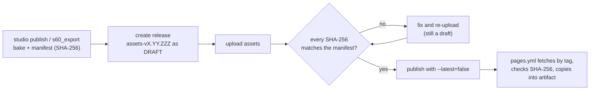

# Budgets

> The byte budget of the site per asset class (500 MB in total), which files live in git and which are GitHub Release
> assets, the overflow rule, the draft → verify → publish asset-release flow, the history policy and how CI enforces
> every number. · Part of: [Web](README.md) · Related: [compute tiers](compute-tiers.md) ·
> [DEC-0007 large assets as release assets](../architecture/decisions/DEC-0007-large-assets-as-release-assets.md) ·
> [deployment](../architecture/deployment.md) · [release and cite](../guides/release-and-cite.md)

## What and why

A static site that replays GPU simulations, RTX renders, point clouds and trained models can grow without limit, and a
git repository that stores them grows forever. GitHub Pages caps a published site at 1 GB, deploys in at most
10 minutes, and has a soft bandwidth limit of 100 GB per month [1]. Git warns at 50 MiB per file and blocks files over
100 MiB [2]. PitStudio sets its own, stricter budget so that the site loads fast, stays deployable, and keeps the
repository small: **500 MB in total**, split by class, with per-file caps.

## The budget

| Item | Budget | Notes |
|---|---|---|
| Initial JS | ≤ 200 KB gzip | scripts loaded by the start page; enforced today by `web/scripts/postbuild.mjs` |
| First view | ≤ 2 MB | bytes before the first interaction, incl. Bingham LOD-0 terrain |
| Videos | ≤ 150 MB | 6 pairs of AV1 1080p + H.264 720p, ≤ 25 MB per pair, plus WebP posters |
| Tiles + glb | ≤ 95 MB | 3D Tiles terrain and equipment models |
| Replay shards + point clouds | ≤ 60 MB | each shard ≤ 10 MB |
| Splats | ≤ 25 MB | one scene (E2 survey) |
| ONNX | ≤ 80 MB | each live model ≤ 25 MB; the live set is ≈ 52–69 MB; precompute-only models are not shipped |
| Runtimes | ≤ 55 MB | self-hosted, loaded only on user action (breakdown below) |
| Own JS / WASM / fonts | ≤ 10 MB | the app's own code and the self-hosted fonts |
| Studio showcase | ≤ 25 MB | tool map and tool-page JSON, run telemetry summaries, stills, Cosmos text |
| **Site total** | **= 500 MB** | 150 + 95 + 60 + 25 + 80 + 55 + 10 + 25 |

Per-artefact caps used across the site:

| Artefact | Cap |
|---|---|
| A live ONNX model | ≤ 25 MB (`specs/000-foundation/thresholds.yaml`: `model_file_mb_target: 25`) |
| Any model file (hard cap) | ≤ 95 MB (`model_file_mb_hard_cap: 95`) |
| A video pair | ≤ 25 MB |
| A replay or point-cloud shard | ≤ 10 MB |
| GPU telemetry of one published run | ≤ 200 KB |
| TensorRT result tables | < 200 KB |
| Cosmos answers and captions | < 1 MB of text |

### Runtimes, measured

The runtime budget was derived from the published package files, not estimated:

| Runtime | Size (MB) |
|---|---|
| ORT-web 1.30, one build that loads in every browser: JSEP `.wasm` + `.mjs` glue (asyncify alternative: 26.78) | 28.31 |
| Pyodide load set: `pyodide.asm.wasm` + `.mjs`, `python_stdlib.zip`, `pyodide-lock.json` | 13.54 |
| `numpy` wheel for Pyodide | 2.96 |
| `PyYAML` wheel for Pyodide | 0.11 |
| Rapier 0.21.0 | 3.42 |
| **Worst case** (all loaded, plus the small `minephys` wheel) | **≈ 48.5** |

$28.31 + 13.54 + 2.96 + 0.11 + 3.42 = 48.34$ MB before the `minephys` wheel, inside the 55 MB class budget. Sources of
the packages: [3][4][5].

### Worked example: a video pair

The size of a constant-bitrate clip is $S = R\,t/8$, with $S$ in megabytes, $R$ the bitrate in Mbit/s and $t$ the
duration in seconds. A 30 s H.264 1080p clip at 6 Mbit/s is $6 \times 30 / 8 = 22.5$ MB, which alone would use almost a
whole pair budget. PitStudio therefore pairs **AV1 at 1080p** with **H.264 at 720p**, encodes with a VMAF quality target
rather than a fixed bitrate, and checks the pair against 25 MB ([encode videos](../guides/encode-videos.md)).

## Git versus release assets

| Where | What | Limits |
|---|---|---|
| **git** | Files < 10 MB each, and ≤ 100 MB of baked assets in total | `tools/check_repo.py` fails on tracked files > 10 MB (today) |
| **GitHub Release assets** of the PitStudio repository | Videos, splats, models > 10 MB, and overflow archives | each file < 2 GiB, up to 1,000 assets per release, no total-size or bandwidth limit [6] |
| **npm, at build** | ORT-web, Pyodide, Rapier runtimes | pinned by the lock file; copied into the artifact, never fetched from a CDN |

Release assets are **copied into the Pages artifact at build time** by `pages.yml` and served from the same origin;
the browser never fetches a Release asset directly. Each one is pinned by SHA-256 in the manifest
([DEC-0007](../architecture/decisions/DEC-0007-large-assets-as-release-assets.md)).

**Overflow rule.** When a class of small files (tiles, shards) grows past the in-git cap, it ships as a release-asset
archive that `pages.yml` unpacks into the artifact at build.

A Hugging Face Hub repository under the maintainer's account remains the alternative for files over 2 GiB or for
datasets shared with other projects; it is not the default because uploads need a write token.

## Asset-release flow

Asset releases use their own tag series, `assets-vX.YY.ZZZ`, separate from the product release `vX.YY.ZZZ` cut by
`tools/release.py`, and are compatible with immutable releases:



1. Bake the assets and write the manifest with each file's SHA-256 (`s60_export`, `studio publish`).
2. Create the release `assets-vX.YY.ZZZ` **as a draft**.
3. Upload every asset.
4. Verify every uploaded file's SHA-256 against the manifest.
5. Publish with `--latest=false`, so the product release `vX.YY.ZZZ` stays "Latest".
6. `pages.yml` downloads the assets by tag, checks each SHA-256 again, and copies them into the artifact.

Every re-bake gets a **new** tag; an asset release is never edited after publication.

```bash run deferred=P6
gh release create assets-v0.01.000 --draft --title "assets v0.01.000" --notes-file assets-notes.md
gh release upload assets-v0.01.000 dist/assets/*
gh release download assets-v0.01.000 --dir .tmp/assets-verify
(cd .tmp/assets-verify && sha256sum -c ../../dist/assets/SHA256SUMS)
gh release edit assets-v0.01.000 --draft=false --latest=false
```

The bake that writes `dist/assets/` and its checksum list (from the manifest) is written in the build phase; the
`gh` and `sha256sum` steps are standard tools.

## History policy

Heavy assets are re-baked only at releases, never per commit, so that the repository history stays small. CI checks
every tracked file's size, the in-git total of baked assets and the repository size, so that history cannot grow past
about 1 GB through re-baked assets.

## CI enforcement

| Check | Status |
|---|---|
| Initial JS ≤ 200 KB gzip (`web/scripts/postbuild.mjs` sums the gzip size of the scripts the start page loads and exits 1 above the budget) | **today** |
| Tracked files ≤ 10 MB (`tools/check_repo.py`) | **today** |
| Per-class budgets and the 500 MB total | build phase |
| In-git total ≤ 100 MB and repository size | build phase |
| Each live model ≤ 25 MB, each video pair ≤ 25 MB | build phase |
| First view ≤ 2 MB, measured by Playwright | build phase |
| Every served file's SHA-256 equals its manifest entry | build phase |
| Lane labels agree with the measured gate | build phase |

The postbuild step prints one line per build, of the form
`postbuild: Pages layout ready; start page loads <n> scripts, <x> KB gzip (budget 200.0 KB)`.

## Assumptions and limits

- Class budgets were derived from measured runtime sizes and model-size estimates; the model and media numbers are
  re-measured when the artefacts exist and the budgets only change by a spec change.
- Pages' cache lifetime and HTTP range support are not relied on: shards are separate files of ≤ 10 MB and all file
  names are content-hashed.
- Precompute-only models (RF-DETR-Seg-N at 61 MB fp16, D-FINE-S fp32 at 40 MB) never ship to the browser; only their
  outputs do.

## In PitStudio

- Foundation NFR-000-01 (initial JavaScript) in `specs/000-foundation/spec.md`; the other budget requirements are
  added to it in the specification phase; thresholds in
  `specs/000-foundation/thresholds.yaml` (`web.*`).
- Specs `016-export-acceleration` (export, budgets) and `018-web-cases`.
- Status: initial-JS and file-size checks run today; nothing heavy is baked yet.

## References

1. GitHub Docs, "GitHub Pages limits" — 1 GB site, 10-minute deploys, 100 GB/month soft bandwidth. https://docs.github.com/en/pages/getting-started-with-github-pages/github-pages-limits
2. GitHub Docs, "About large files on GitHub" — warning at 50 MiB, block at 100 MiB. https://docs.github.com/en/repositories/working-with-files/managing-large-files/about-large-files-on-github
3. npm registry, `onnxruntime-web` latest — 1.30.0. https://registry.npmjs.org/onnxruntime-web/latest
4. npm registry, `pyodide` latest — 314.0.7. https://registry.npmjs.org/pyodide/latest
5. npm registry, `@dimforge/rapier3d-compat` latest — 0.21.0. https://registry.npmjs.org/@dimforge/rapier3d-compat/latest
6. GitHub Docs, "About releases" — each asset < 2 GiB, up to 1,000 assets, no total-size or bandwidth limit. https://docs.github.com/en/repositories/releasing-projects-on-github/about-releases
