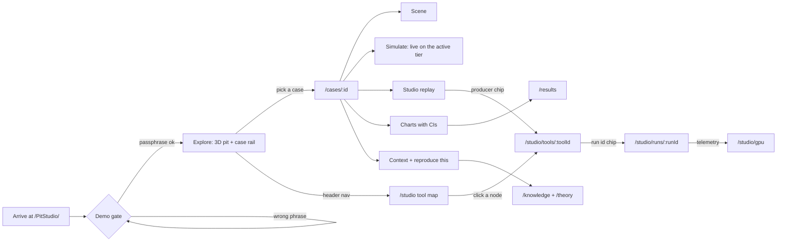

# User flow

> How each audience moves through the site — from the gate to a live case, a studio replay, the tool that produced it
> and the run behind it — and which interactions are opt-in. · Part of: [Web](README.md) · Related:
> [structure](structure.md) · [compute tiers](compute-tiers.md) · [showcase rules](showcase-rules.md) ·
> [reproduce a case](../guides/reproduce-a-case.md)

## What and why

PitStudio serves four audiences with different questions (mining engineers and managers, data/AI practitioners,
students, developers) plus reviewers who want to check claims. The flow is designed so that every audience reaches its
answer in a few clicks, and so that every number on the way can be traced back to the tool, the run and the manifest
that produced it. The site is a **workbench, not a billboard**: nothing autoplays, the shared timeline starts paused,
and heavy runtimes load only when the visitor asks for them.

## The main flow

*Every step after the gate is reachable from the header too; the arrows show the links a page offers in context.*

1. **Arrive.** The prerendered HTML shows the shell and a "Loading…" status, then the demo gate when the build has one
   ([access gate](access-gate.md)). The gate says on screen that it is not a security boundary.
2. **Explore (`/`).** A 3D pit built from real terrain (USGS 3DEP, Bingham Canyon), the case rail with the 12 cases in
   five categories, layers, KPIs and the **tier badge** (T1 WebGPU, T2 WebAssembly or T0 baked). The shared timeline is
   paused; the visitor presses play or scrubs.
3. **Pick a case (`/cases/:id`).** The five sub-tabs: Scene, Simulate (live), Studio replay, Charts, Context.
   "Simulate" runs the case's live engine on the active tier; the KPIs update as the visitor changes inputs.
4. **Follow a replay to its producer.** Each artefact card carries a lane badge and provenance chips. The producer chip
   opens the tool page (`/studio/tools/:toolId`); the run chip opens the run page (`/studio/runs/:runId`) with the
   manifest, stage DAG and telemetry.
5. **Check the claim (`/results`).** Learned versus classical on held-out data with paired confidence intervals; where
   the interval includes 0 the page says "no significant difference".
6. **Learn the theory (`/theory`, `/methods`, `/knowledge`).** Equations, parameter tables with citations and
   verification status, glossary EN/ES, bibliography.
7. **Reproduce.** Each case and tool page shows the runner command that reproduces its artefacts on a workstation
   ([reproduce a case](../guides/reproduce-a-case.md)).

## Paths per audience

| Audience | Question | Path |
|---|---|---|
| Mining engineer / manager | What do dispatch, road grade, electrification and fragmentation do to t/h, kWh/t and CO₂/t? How early does radar warn of a wall failure? How far does a tailings breach travel? | `/` → `/cases/A1` (or A2, D1, C1, C2) → Simulate → Charts → Context |
| Data / AI practitioner | How far does synthetic-only training go? Does a learned surrogate replace a GPU simulation? What does a vision-language model get right? | `/results` → a case's Studio replay → `/studio/tools/isaac-sim-replicator` → `/studio/runs/:runId` |
| Student | What are the equations and assumptions? | `/theory` → interactive figure → `/knowledge` (parameters, glossary) |
| Developer | How is the pipeline built and operated on one workstation? | `/studio` tool map → tool page → run page → `/studio/gpu` → [guides](../guides/README.md) |
| Reviewer / citer | Is every number sourced, every lane labelled, every gap stated? | any artefact card → provenance chips → manifest → [showcase rules](showcase-rules.md) |

## Interaction rules

| Rule | Why | Where it is enforced |
|---|---|---|
| The shared timeline (`SimClock`) starts paused; explainer steps set the clock and camera but never autoplay | Workbench, not billboard; reduced-motion users | case and Explore routes |
| Motion respects `prefers-reduced-motion` | Accessibility (WCAG 2.2 AA) | shell + every animated view |
| Videos use `preload="none"`; `MediaCapabilities` picks AV1 1080p or H.264 720p; a WebP poster shows first | Byte budget; codec support differs by browser [1][2] | media cards |
| ORT-web, Pyodide and Rapier load only on a user action (opening a live tab or pressing "run in Python") | First view ≤ 2 MB; runtimes are up to ≈ 48.5 MB ([budgets](budgets.md)) | engine loaders |
| The active tier is always visible; a failed tier falls back to the next and the badge changes | FR-000-02 | tier badge |
| The site never contacts `localhost` on its own; a "connect to my local studio" button performs an opt-in probe, and declining changes nothing | Chrome Local Network Access prompts on any public-to-loopback request [3]; FR-000-11 | studio pages |
| Language: `?lang=` beats the stored choice, which beats English; the browser language is never used | Deterministic, shareable links | shell (exists) |
| Theme: system, light or dark, applied before first paint | No flash of the wrong theme | shell (exists) |

## Fallback and error flows

- **No WebGPU** → T2: live engines run on WebAssembly; GPU-compute views (granular, water and dust fields) switch to
  replay shards. **A runtime fails** → T0: precomputed outputs only. See [compute tiers](compute-tiers.md).
- **An artefact fails its SHA-256 check** against the manifest → the card shows the error instead of the artefact.
- **Unknown URL** → `404.html` (status 404) with the app's not-found page inside the normal frame.
- **A view throws** → the error view inside the frame: "This view failed to load. Reload the page; if it keeps
  failing, open an issue on GitHub."
- **Storage blocked** (private modes) → the gate asks again on each page load; language and theme fall back to their
  defaults.

## Assumptions and limits

- The flow assumes a desktop or laptop browser for the 3D and GPU views; phones get the same routes with lower per-tier
  budgets and more replay.
- Studio replays are recorded on one reference machine (RTX 5000 Ada Laptop GPU, 16 GB); the site states this on every
  precomputed card rather than implying the visitor's hardware produced it.
- Results pages show only what has been run. Until the data-and-models phase, every result reads "**Not yet run**".

## In PitStudio

- Specs `018-web-cases`, `019-web-studio`, `020-web-knowledge`; foundation requirements FR-000-01 to FR-000-07 and
  FR-000-11 in `specs/000-foundation/spec.md`.
- Today: the gate, language and theme flows exist and are covered by `web/e2e/shell.spec.ts`; everything after the
  gate is a stub.

## References

1. caniuse, "AV1 video format" — about 95 % support; Safari depends on hardware decoding. https://caniuse.com/av1
2. MDN, `HTMLVideoElement.requestVideoFrameCallback()` — Baseline since October 2024. https://developer.mozilla.org/en-US/docs/Web/API/HTMLVideoElement/requestVideoFrameCallback
3. Chrome for Developers, "Local Network Access". https://developer.chrome.com/blog/local-network-access
